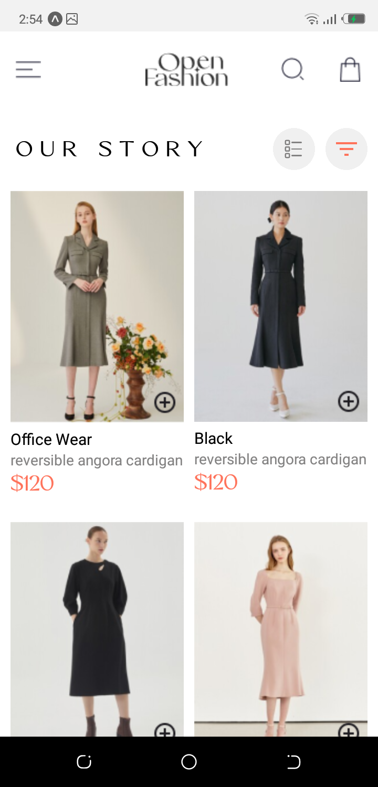
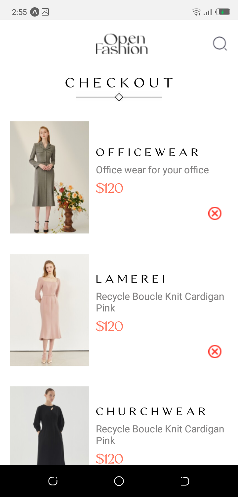
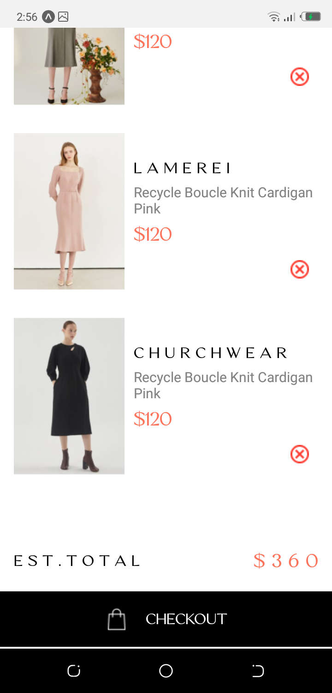
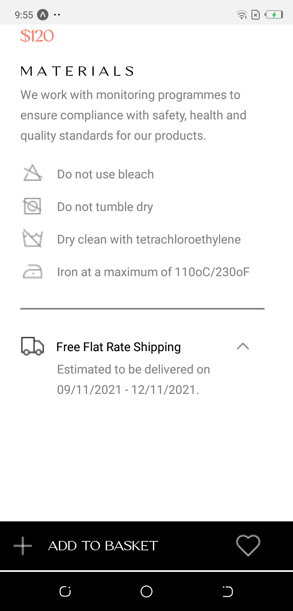

# rn-assignment7-11205670

# Design Choices

## Font Choice:

The Vogue Sans font was chosen to align with the fashion-forward theme of the app. It provides a sleek and modern look, enhancing the overall user experience.

## Layout and Navigation:

The app uses a simple, intuitive layout with clear sections for different functionalities. Navigation between screens is handled using React Navigation, providing a smooth transition experience for users. You can navigate from the homeScreen to the cartScreen by tapping on the bag icon located at the top right corner of the homescreen and can also navigate back to the homeScreen from the cartScreen by pressing the back button of the phone.

## Images and Icons:

High-quality images and icons are used to represent products and actions, making the app visually appealing and easy to use.

## Color Scheme:

The app uses a minimalistic color scheme with white backgrounds, black text, and accent colors like #ff735b for highlighting prices and actions.

# Implementation

## Fonts

The Vogue Sans font is loaded using the useFonts hook from expo-font. The font files are stored in the assets/fonts directory, and the AppLoading component ensures that the app only renders once the fonts are loaded.

# Screenshots

## Screenshots of the app

